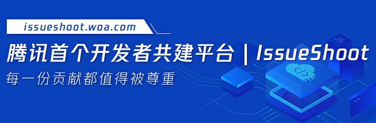

# 欢迎来到腾讯首个开发者共建平台 —— IssueShoot

嗨！朋友们，你是不是想为腾讯开源项目贡献一份力量，却苦于找不到切入点？

想与技术大咖深度交流，和同频开发者切磋学习，却缺少合适的契机？

想在一个活力满满、创意迸发、挑战不断的平台上，尽情展现自己的编码实力？

如果这些正是你所期待的，那么IssueShoot绝对是你的不二之选 —— 这里是腾讯首个开发者共建平台，更是开发者共建共享的优质平台。

## 01 什么是IssueShoot？

IssueShoot是腾讯首个开发者共建平台，旨在打造随时随地跨BG跨部门跨项目的协同共建文化。

IssueShoot于2022年4月诞生，同年8月上线技术图谱，从诞生至今，已经汇聚了百余个开源项目和近千名的贡献者。这些贡献者们有一个共同的名字——shooter。

shooter就是issue认领人，他们追求精准、及时地解决issue，像箭中靶心一样，将发布的issue精、准、快地解决，正是shooter们的使命。你在IssueShoot 贡献的每一步，都将得到充分的尊重和认可~

| 开源项目 | Open issue | 技术领域 | issue 地址 |
|:-------:|:----------:|:---:|:----:|
| TencentOS | 32 | 硬件 | [查看 issue](https://github.com/Tencent/tdesign-vue/issues?q=state%3Aopen%20label%3AIssueShoot "查看 issue") |
| tRPC | 56 | \ | [查看 issue](https://github.com/Tencent/tdesign-vue/issues?q=state%3Aopen%20label%3AIssueShoot "查看 issue") |
| TDesign | 12 | 设计、大前端 | [查看 issue](https://github.com/Tencent/tdesign-vue/issues?q=state%3Aopen%20label%3AIssueShoot "查看 issue") |

<iframe 
  src="https://docs.qq.com/aio/DTk1wUUFHUkZCQkZN"  
  width="100%" 
  height="800"  
  frameborder="0" 
  allowfullscreen  
></iframe>

## 02 我能收获什么？
技术成长
结识的技术大牛，拓展技术视野，提升coding能力，与志同道合的技术人一起努力，共同成长！

技术荣誉
💘IssueShoot系列勋章，让你的每一份贡献都能被看见。

✍🏻有机会成为Oteam及开源项目的核心贡献者、个人PMC，参与到产品的开发讨论中。

📝有机会参与评选开源协同优秀个人/个人即时激励。

🌸参与技术公益类issue共建将获得公益证书、公益时长、小红花及配捐金。

特色奖品
平台奖品：每赛季根据不同主题的活动和玩法，配置超丰富的奖品，详情可参考各赛季规则设置。专场加码奖品：不定期开设Oteam/BG/技术公益专场，每个专场配置不同周边礼品。

## 03 我要怎么参与？
如何认领issue，参与共建，只需要短短几步就ok啦！

登入IssueShoot共建基地
选择想认领的issue，点击【立即入群沟通】

在规定时间完成issue，待发布方审核通过，就可以累积贡献值啦！

 

总而言之，无论你是什么技术栈、什么技术领域，无论你是想交流经验还是结识朋友，IssueShoot都欢迎你加入我们一起成长！一起参与共建！
